# Ordinal-Aware Deep Learning for Diabetic Retinopathy Grading

> Master's thesis project — five-class diabetic-retinopathy (DR) severity grading
> from retinal fundus photographs, with an **ordinal-aware supervised contrastive**
> method (**OrdSupCon**), a strong regularisation recipe, model ensembling, and a
> clinical-grade evaluation including uncertainty and explainability.

<p align="left">
  
  
  
</p>

<p align="center">
  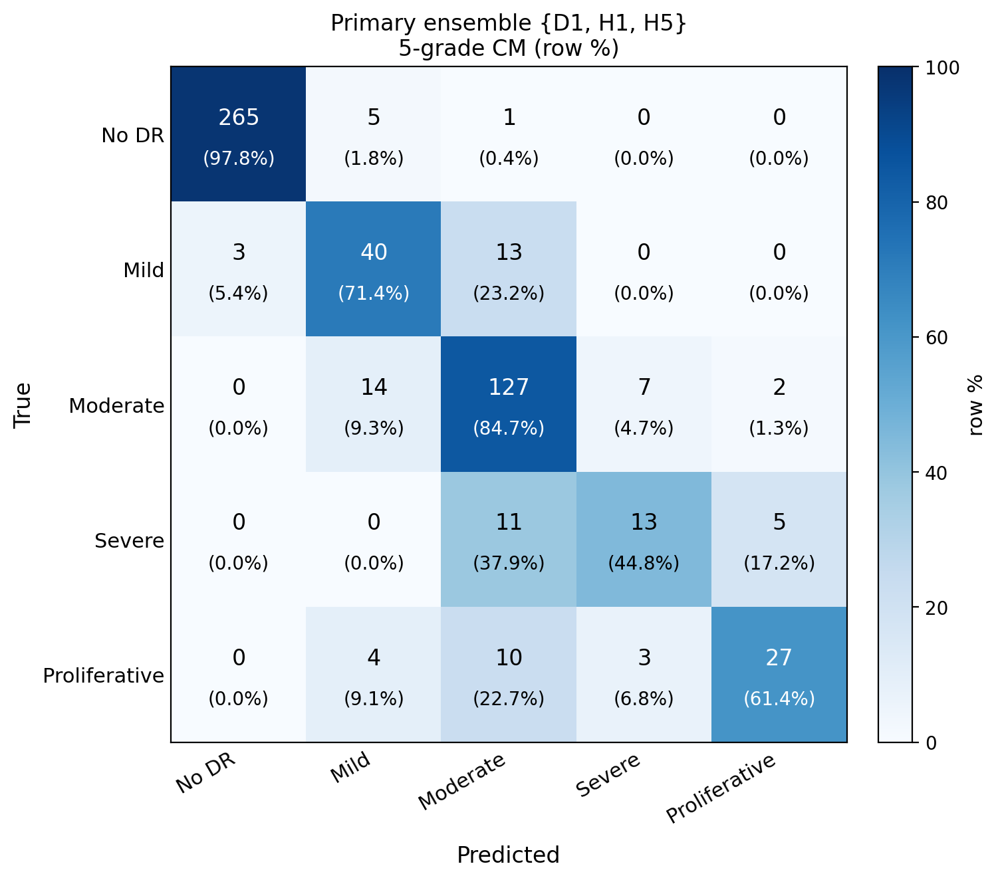
  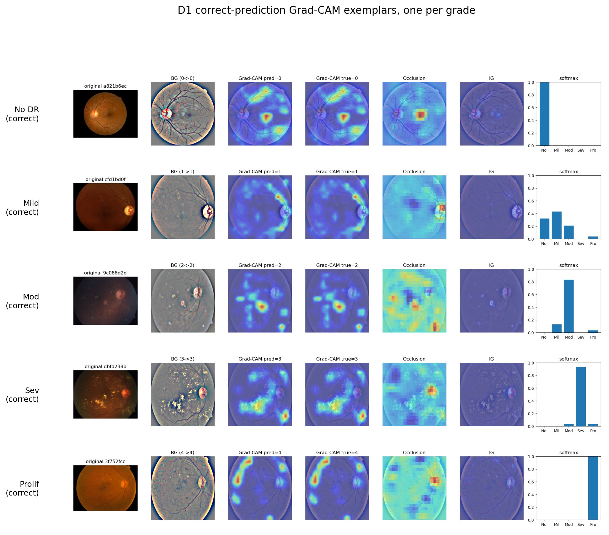
</p>

---

## Highlights

- **QWK 0.9175** with a single ResNet-50 ("D1" recipe) on the APTOS-2019 test set (n = 550).
- **{D1, H1, H5} ensemble:** Macro-F1 **0.7324**, QWK **0.9149**, with study-best minority-grade F1 (Severe **0.50**, Proliferative **0.69**).
- **Clinically safe:** at the referable threshold (grade >= 2) the ensemble reaches **95.7% specificity / 91.9% sensitivity**, and **never** grades a Severe/Proliferative eye as "No DR".
- **A rigorous null result:** across two corpora and seven protocols, standalone **OrdSupCon does not beat ImageNet initialisation on QWK** — but the OrdSupCon backbones are valuable **ensemble diversifiers** for minority grades.
- **Reproducible by design:** 100+ experiments encoded as a `config.py` registry; all reported numbers come from one bootstrapped metrics file.

---

## Table of contents
1. [Overview](#overview)
2. [Key contributions](#key-contributions)
3. [Method](#method)
4. [Datasets](#datasets)
5. [Repository structure](#repository-structure)
6. [Installation](#installation)
7. [Usage / reproduce](#usage--reproduce)
8. [Experiments](#experiments)
9. [Results](#results)
10. [Explainability](#explainability)
11. [Limitations & future work](#limitations--future-work)
12. [Acknowledgements](#acknowledgements)

---

## Overview

Diabetic retinopathy is a leading cause of preventable blindness; automated
grading must respect the **ordinal** clinical scale (No DR -> Mild -> Moderate ->
Severe -> Proliferative) and, above all, must not under-grade sight-threatening
disease. This project studies whether injecting that ordinal structure directly
into the learned representation — via an ordinal supervised contrastive loss —
improves grading, especially on the scarce Severe/Proliferative classes.

<p align="center">
  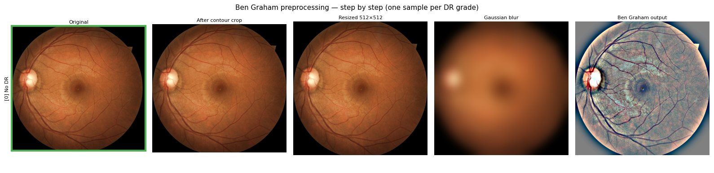<br>
  <em>Ben Graham preprocessing: fundus crop + illumination normalisation.</em>
</p>

The primary metric is **Quadratic Weighted Kappa (QWK)**, which penalises errors
by the square of the grade distance; Macro-F1 and per-class F1 track minority
behaviour.

---

## Key contributions

1. **A strong, fully specified recipe ("D1").** ImageNet init + Focal loss +
   class weights + GeM pooling + dropout + cosine LR + advanced augmentation +
   offline oversampling -> **QWK 0.9175**, reproducible from one config id.
2. **A robust null result on OrdSupCon.** Two-corpus (EyePACS + APTOS),
   seven-protocol evaluation showing OrdSupCon alone does not beat ImageNet on QWK.
3. **Ensemble diversity from disagreement.** Two OrdSupCon backbones pre-trained
   on *different* corpora (cross-domain EyePACS vs in-domain APTOS) encode
   orthogonal minority-class signal; the {D1, H1, H5} ensemble sets the study's
   best Macro-F1 and minority F1s.
4. **Clinical evaluation.** Referability framing, MC-Dropout uncertainty,
   calibration (ECE), and error-risk stratification.
5. **An honest ablation catalogue.** 30+ controlled experiments, including a
   documented set of techniques that *failed*, with root causes.

---

## Method

Full details in **[docs/methodology.md](docs/methodology.md)**. In brief:

- **Preprocessing:** Ben Graham fundus crop + Gaussian illumination subtraction,
  512x512, ImageNet normalisation; offline oversampling to 1,000 images/class.
- **Backbone:** ResNet-50 (ImageNet) with learnable **GeM** pooling and a
  `Dropout(0.3) -> Linear(2048->5)` head (dropout kept for MC-Dropout UQ).
- **Losses:** Focal (gamma=2) + inverse-frequency class weights as the primary
  objective; **OrdSupCon** for contrastive pre-training, with ordinal pair weight

  ```
  W(i, j) = 1 - |g_i - g_j| / (K - 1),    K = 5
  ```

  so adjacent grades attract and distant grades repel.
- **Two-stage pipeline:** (1) optional OrdSupCon pre-training of the backbone;
  (2) supervised fine-tuning with a freeze->unfreeze schedule, cosine LR, TTA, and
  optimised cumulative thresholds.

---

## Datasets

| Dataset | Role | Link |
|---------|------|------|
| APTOS 2019 | Train + test (primary) | [Kaggle](https://www.kaggle.com/c/aptos2019-blindness-detection) |
| EyePACS | OrdSupCon pre-training (35k) | [Kaggle](https://www.kaggle.com/c/diabetic-retinopathy-detection) |
| IDRiD | Severe/Proliferative supplement | [IDRiD challenge](https://idrid.grand-challenge.org/) |
| Messidor-2 | External validation | [ADCIS](https://www.adcis.net/en/third-party/messidor2/) |

Datasets are **not** included in the repo. Download them and place under
`data/`, `Eyepacs/`, `messidor-2/`, `B_Disease_Grading/` (IDRiD); these paths are
git-ignored. Class distribution and split details are in
[docs/methodology.md](docs/methodology.md).

<p align="center">
  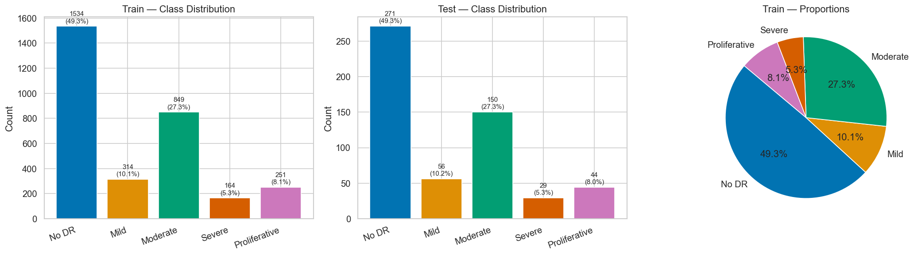
  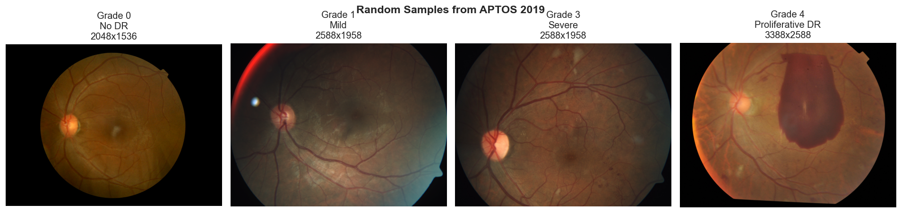
</p>

---

## Repository structure

```
dr-nrt/
├── run_experiment.py        # main entry point: python run_experiment.py --exp <ID>
├── run_all.sh, run_phase_subA.sh
├── requirements.txt
├── src/                     # core package
│   ├── config.py            # ExpConfig registry — every experiment as a dataclass
│   ├── dataset.py           # DRDataset, ContrastiveDRDataset, Ben Graham preprocessing
│   ├── models.py            # ResNet-50 + GeM + heads (build_model)
│   ├── losses.py            # Focal, OrdSupCon, CORN, CumLink, EMD, SORD, LA-CE
│   ├── train.py             # supervised + contrastive training loops
│   ├── evaluate.py          # QWK, F1, AUC, ECE, threshold optimisation
│   ├── transforms.py        # augmentation levels 0/1/2 (Albumentations)
│   ├── tta.py, ensemble.py, pseudo_label.py
│   └── analysis/            # explainers, calibration, fundus CV, quality metrics
├── scripts/                 # eval, preprocessing, figure builders, canonical metrics
├── notebooks/               # EDA, training, ensemble inference, explainability
├── docs/                    # methodology.md, experiments.md, results.md
└── figures/                 # curated result figures (PNG)
```

---

## Installation

```bash
git clone https://github.com/khanhmay004/dr-nrt.git
cd dr-nrt
python -m venv .venv && source .venv/bin/activate   # Windows: .venv\Scripts\activate
pip install -r requirements.txt
```

Requires Python 3.10+ and a CUDA-capable GPU for training (CPU works for
inference/analysis). Key dependencies: PyTorch, Albumentations, coral-pytorch,
grad-cam, captum, scikit-learn.

---

## Usage / reproduce

**Train an experiment** (everything is config-driven by id):

```bash
python run_experiment.py --exp 300 --device cuda --workers 4   # D1 single-model champion
```

**Evaluate a checkpoint** with a chosen decoder:

```bash
python scripts/eval_checkpoint.py --exp 300 --thresh cumulative
python scripts/eval_messidor2.py  --exp 300        # external validation
python scripts/mc_dropout_eval.py --exp 300        # uncertainty (T=20)
```

**Reproduce the headline ensemble:** open
[`notebooks/aptos-ensemble-d1-h1-h5.ipynb`](notebooks/aptos-ensemble-d1-h1-h5.ipynb).

**Recompute all metrics + bootstrap CIs:**

```bash
python scripts/compute_canonical.py   # writes scripts/_canonical_metrics.json
```

---

## Experiments

Experiments are grouped into phases (full table in
**[docs/experiments.md](docs/experiments.md)**):

| Phase | Ids | Theme |
|-------|-----|-------|
| 1 — Ablation | 0–14 | progressive recipe build-up |
| A — Sampling & OrdSupCon | 100–201 | oversampling + in/cross-domain pre-training |
| D — Regularisation | 300 | **D1 champion** |
| F — Joint contrastive | 501–504 | auxiliary OrdSupCon during fine-tuning |
| G — Ordinal losses | 600–605 | CORN, EMD2, CumLink |
| H — LP-FT | 700–705 | linear-probe-then-finetune (H1, H5) |
| I — Rescue / Champion | 802–900 | SORD, SWAD, L2-SP, FLYP |

The three headline models: **D1** (ImageNet), **H1** (OrdSupCon @ EyePACS), **H5**
(OrdSupCon @ APTOS). H1 and H5 use *different* OrdSupCon initialisations.

<p align="center">
  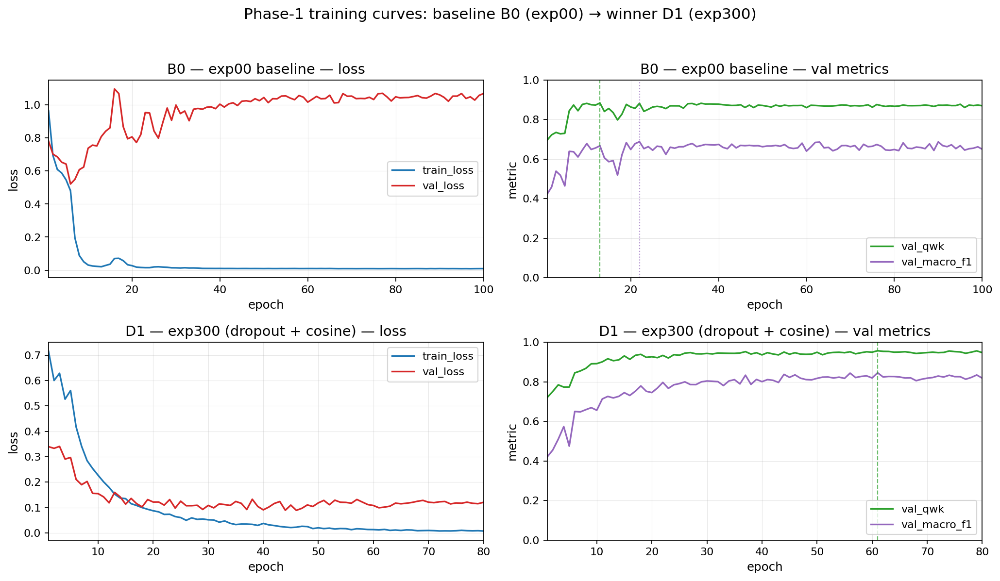
  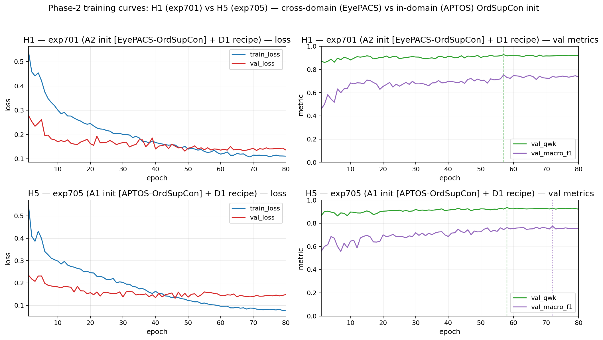
</p>

---

## Results

Computed on the APTOS test set (n = 550) with stratified bootstrap (5,000
resamples). Full tables and CIs in **[docs/results.md](docs/results.md)**.

**Single model (argmax unless noted):**

| Model | QWK | Macro-F1 | Acc | F1 Severe | F1 Prolif |
|-------|-----|----------|-----|-----------|-----------|
| D1 (exp300) | 0.9159 | 0.6945 | 0.853 | 0.383 | 0.667 |
| D1 + cum-opt thresholds | **0.9175** | 0.689 | 0.845 | 0.423 | 0.649 |
| H1 (OrdSupCon-EyePACS) | 0.9028 | 0.686 | 0.818 | 0.431 | 0.683 |
| H5 (OrdSupCon-APTOS) | 0.8809 | 0.696 | 0.824 | **0.545** | 0.584 |

**Ensemble (logit averaging):**

| Ensemble | QWK | Macro-F1 | Acc | F1 Severe | F1 Prolif |
|----------|-----|----------|-----|-----------|-----------|
| {D1, H1} | 0.9096 | 0.7052 | 0.851 | 0.431 | 0.640 |
| **{D1, H1, H5}** | **0.9149** | **0.7324** | **0.858** | **0.500** | **0.692** |

**Clinical (referable, grade >= 2):** ensemble sensitivity **0.919**, specificity
**0.957**; no Severe/Proliferative eye predicted as No DR.

<p align="center">
  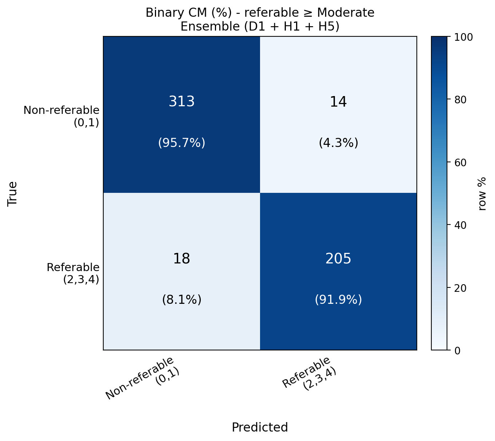
  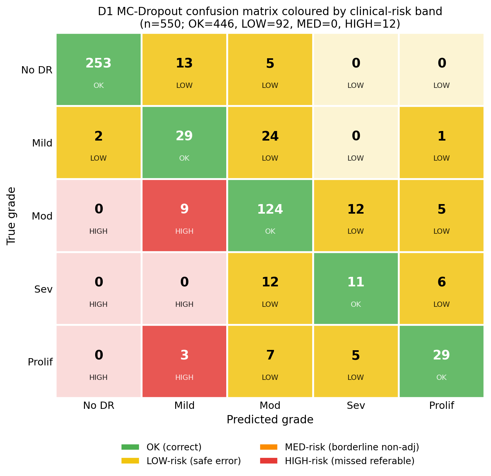
</p>

---

## Explainability

Grad-CAM / Grad-CAM++ attributions are validated against medical criteria
(on-retina energy, lesion-proxy overlap, TTA consistency, insertion/deletion
faithfulness). Error analysis stratifies mistakes by clinical risk and traces
grade-migration. See [`notebooks/explainability.ipynb`](notebooks/explainability.ipynb).

<p align="center">
  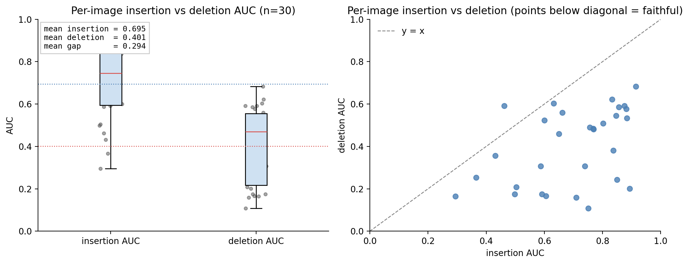
  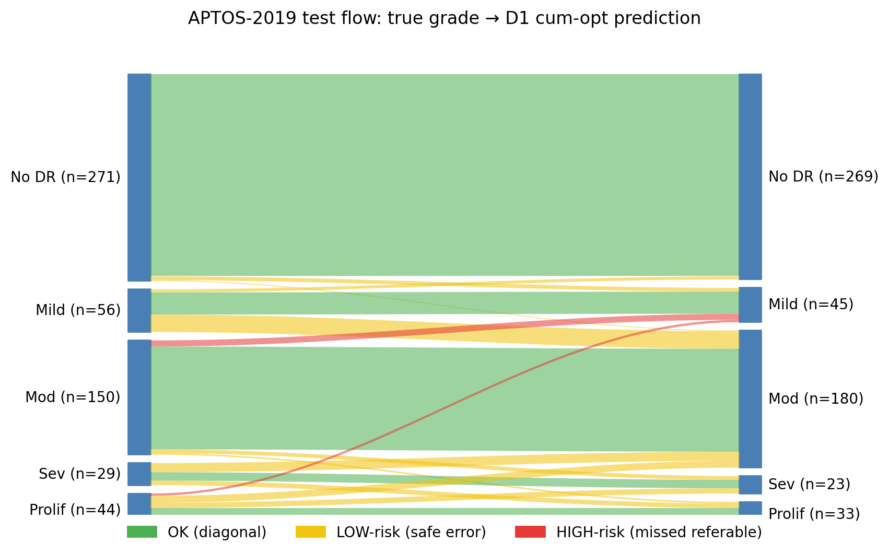
</p>
<p align="center">
  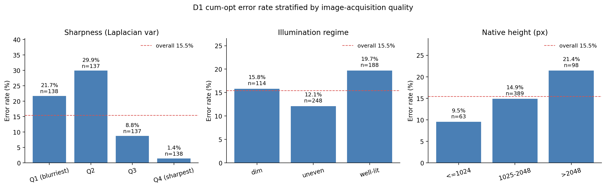
  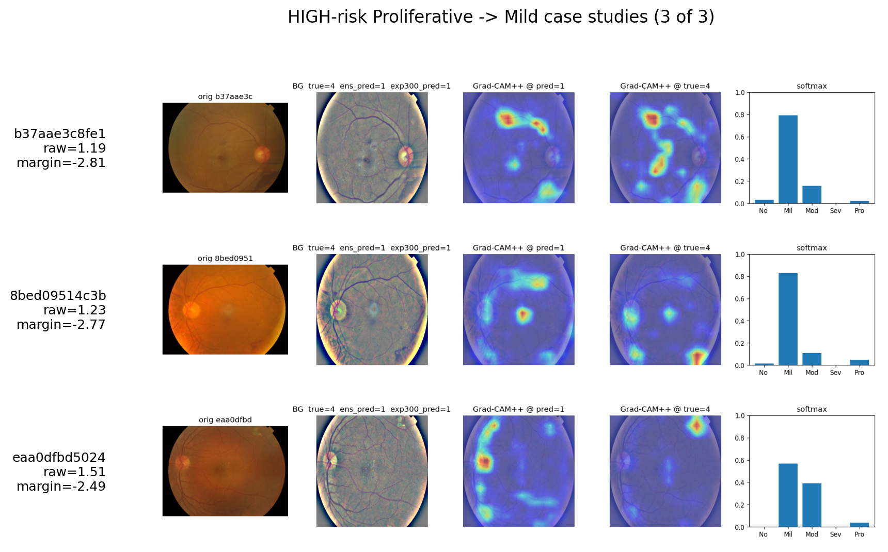
</p>

---

## Limitations & future work

- The Severe grade (n ~ 29 in test) is a variance floor: a ~0.03–0.04 val->test
  QWK gap is largely a small-sample effect, not pure optimisation.
- The next gains likely need **more labelled APTOS-domain Severe/Mild data** or a
  balanced-prior pre-training corpus — not further loss/recipe tuning on the
  current data.
- OrdSupCon helps as an *ensemble diversifier* rather than a standalone replacement
  for ImageNet initialisation on this dataset scale.

---

## Acknowledgements

APTOS 2019 (Kaggle / Aravind Eye Hospital), EyePACS (Kaggle Diabetic Retinopathy
Detection), IDRiD, and Messidor-2 — each dataset is subject to its own licence and
terms of use. Built with PyTorch, Albumentations, coral-pytorch, pytorch-grad-cam,
and Captum.

## License

Code released under the [MIT License](LICENSE). Datasets and model weights are
**not** covered by this licence and retain their original terms.
